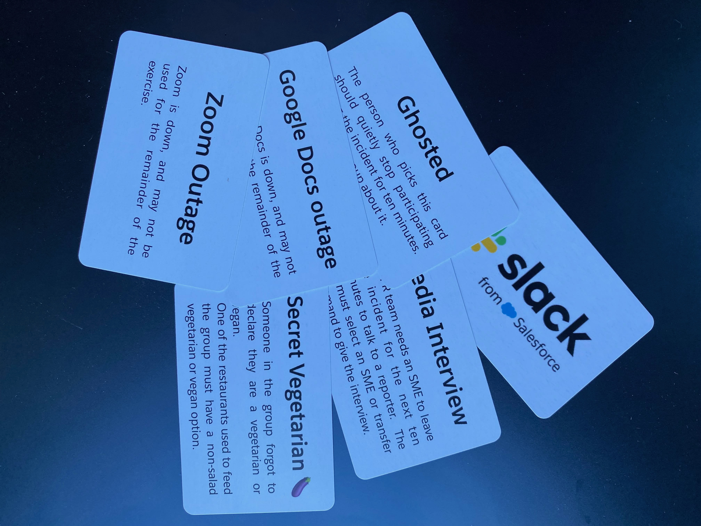
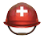
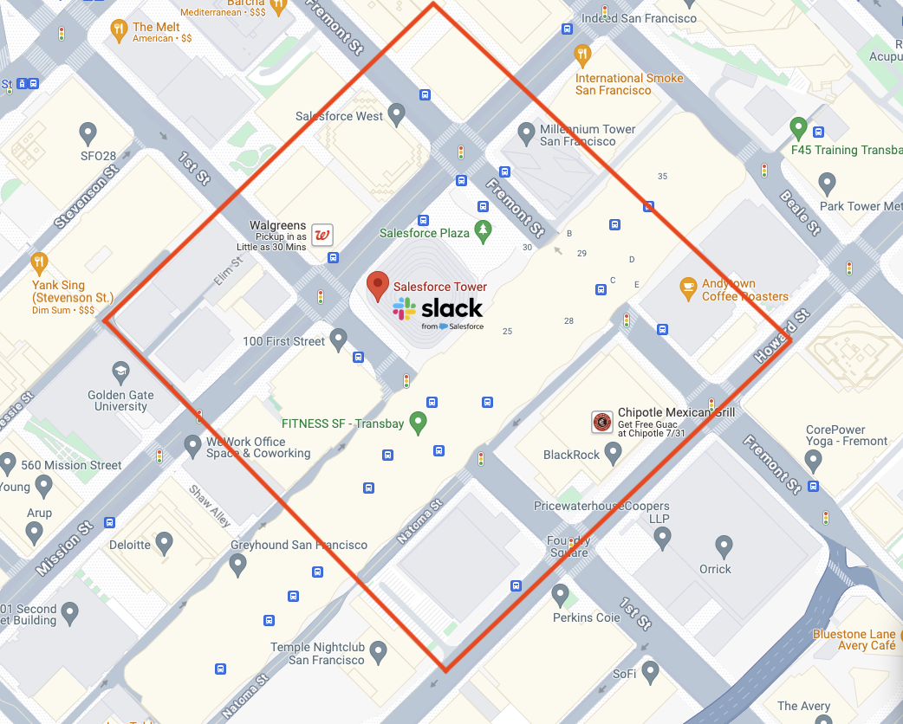

name:title
background-image:url(bg.png)
background-color:white
background-size:50% auto
background-position:100% 0%
layout:true

class:middle, center

.grey[
{{content}}
]

---
name:blue
layout:true
background-image:none
background-color:#4b6bc6

---
name:red
layout:true
background-image:none
background-color:#AA2424

---
name:white
layout:true
background-image:none
background-color:white

.black[
{{content}}
]
---
name:green
layout:true
background-image:none
background-color:#63d297

.darkgrey[
{{content}}
]
---
layout:false
template: title

# Incident Lunch Exercise

---
template: green

# Incident Command System (ICS) Crash Course
## History

* ICS = Incident Command System (aka IMS = Incident Management System)
* Created in California 1970s as a response to manage wildfire response
* Primary Objectives:
  * Coordinate interagency actions
  * Efficiently allocate resources
* The ICS system has since spread nationally and is also used around the world
* https://en.wikipedia.org/wiki/Incident_Command_System

---

## Incident Lifecycle
Primary Focus and Goal -> Restore Service as quickly and safely as possible
Secondary Goals -> Limit Damage and Reduce Recovery time

0. Detect
1. Alert and Assemble
2. Respond, Mitigate, Resolve
3. Learn (Incident Review or Retrospective)

---

## Incident Roles

*   **Incident Commander (IC)**: Facilitates and directs discussion amongst Subject Matter Experts. Drives incident towards resolution.
*   **Subject-Matter Expert (SME)**: Has knowledge and skills that can help restore service. Hands on keyboard, eyes on screen.
*   **Customer Liaison**: Communication liaison between the customer facing org and engineering

---

## Optional Incident Roles on larger incidents

*   **Team Captain**: An SME that is assigned to coordinate a team of SMEs and work directly with the IC 
*   **Comms**: Manages logistics of communication (lets IC focus on the incident).
*   **Scribe**: Keeps notes and logs of all activity in service of the IC and to assist with the Learning phase.  Critical for key discoveries and decisions to be captured and shared by Scribe when service is severely degraded or unavailable.
---

## Incident Commander

* **Understanding**: Drive understanding of the problem(s) at hand across the team(s) responding
* **Action Plan**: Develop plans of action with input from SMEs
  * **Choose a Plan** -- IC often **selects** from plans posed by SMEs
* **Execution**: Directs resources to execute the action plan

---

## Status Report

A concise report useful for quickly sharing information with responders and interested stakeholders.
Updated at a regular interval during an active incident. 30 minutes is a default interval, more frequently for a higher urgency incident.  This is not an ongoing log of states or actions, but a compact report of the *current* set of conditions and actions.

* **C**onditions: current status; how long it's been that way
* **A**ctions: what is being done or needs to be done to restore service
    includes information about leads assigned to current actions
* **N**eeds: what resources are needed
* _When's the next CAN report?_

*A good CAN report will save you time answering questions, and the incident will run more smoothly when everyone knows what's being done and what's needed.  There are sometimes 10x the number of staff in a channel or on a bridge as there are active responders, these reports keep those folks informed without having to read all posts.*

---

## Quick tips

* Be **clear**, concise and direct when typing or speaking
* Develop multiple plans
* Use time boxing to keep things moving
* Focus on roles not individuals, roles change frequently

## Terms
* Staged (available)
* Assigned (engaged)
* Released
* Under Control (customer facing issues are clear)
* All Clear (IR process is no longer required, this is no longer an emergency)

---
template: blue

# Incident Response Lunch Exercise
## Detect
Lunch has fallen through.  The front desk notified us that the bike messenger delivering lunch ended up on the other side of town.

## Notify and Assemble

* If this were a real incident, the IC would be paged to assemble and triage with other responders and roles
* We'll start out by creating and joining a Slack channel called #ics-lunch-next to respond to this incident

---
template: blue

# Incident Response Practice Lunch
## Respond

* Acquire lunch **as quickly** as possible
* Ground rules:
  * must be outside of the lunch exclusion zone shown in the following slides
  * pick up or order in ok
  * budget limit of approx $25/person
  * lunch is expensed, people ordering will need to submit an expense report, keep your receipts!

## Learning
### Once we have resolved our issue we will have open discussion to discuss and learn.

---
template: blue

---
# What's Next?
## Incident Responder and Commander Training
* link to your company training
* and resources

## Join related channels
* \#incidents
* \#announce-incident-response
